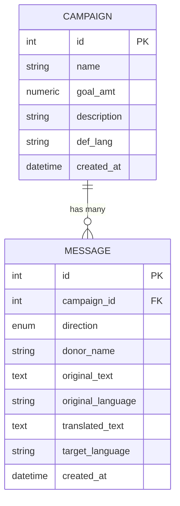

# Entity-Relationship Diagram

## Diagram

GitHub renders the Mermaid block above natively when viewing this file in
the repository.

## Entities

### Campaign

| Field | Type | Constraints | Notes |
|---|---|---|---|
| `id` | integer | primary key, autoincrement | |
| `name` | string | not null | |
| `goal_amt` | numeric(12,2) | not null, `> 0` (enforced at the Pydantic layer) | Stored as exact decimal, not float, since it represents money |
| `description` | string | not null | |
| `def_lang` | string | not null | The organization's default working language for this campaign. Fixed once set — not editable after creation |
| `created_at` | timestamp with time zone | server-generated default (`now()`) | Set by the database, not the application |

### Message

| Field | Type | Constraints | Notes |
|---|---|---|---|
| `id` | integer | primary key, autoincrement | |
| `campaign_id` | integer | foreign key → `campaigns.id`, `ON DELETE CASCADE`, not null | Deleting a campaign deletes its messages |
| `direction` | enum (`outbound`, `inbound`) | not null | `outbound` = staff → donor, `inbound` = donor → staff |
| `donor_name` | string | not null |
| `original_text` | text | not null | The message exactly as originally written — always preserved, even after translation or a later edit re-triggers translation |
| `original_language` | string | not null | For outbound, the campaign's `def_lang` at creation time. For inbound, the language detected by Amazon Comprehend (or a fallback — see README edge cases) |
| `translated_text` | text | nullable | `null` if no translation was needed (languages matched) or if translation failed (see README edge cases) |
| `target_language` | string | not null | For outbound, the donor's preferred language. For inbound, the campaign's `def_lang` |
| `created_at` | timestamp with time zone | server-generated default (`now()`) | |

## Relationships

**Campaign (1) → Message (many)**

- One campaign has zero or more messages.
- Every message belongs to exactly one campaign (`campaign_id` is not
  nullable).
- Deleting a campaign cascades to delete all of its messages
  (`ON DELETE CASCADE` at the database level, mirrored by
  `cascade="all, delete-orphan"` on the SQLAlchemy relationship) — see
  the README's edge case documentation for the reasoning behind this
  choice.

## Migration History

The schema above is built up through the Alembic migrations in
[`migrations/versions/`](../migrations/versions/), applied in order:

1. `add campaigns table`
2. `add messages table`
3. `widen description column`
4. `add table name` (renames the messages table to its final name)